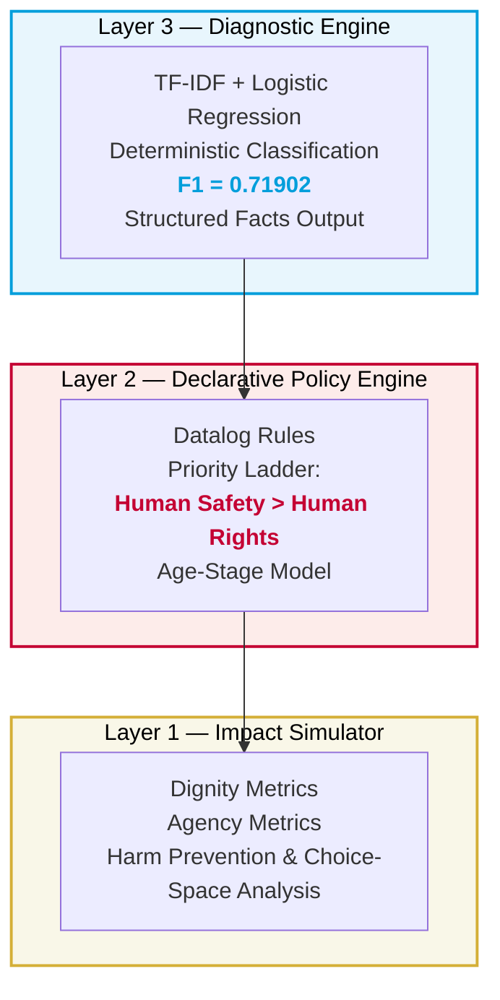

```mermaid
flowchart TD
    subgraph L3["<span style='color:#000000;'>Layer 3 — Diagnostic Engine</span>"]
        A["TF-IDF + Logistic Regression<br/>Deterministic Classification<br/><b style='color:#009EDB;'>F1 = 0.71902</b><br/>Structured Facts Output"]
        style L3 fill:#E8F6FD,stroke:#009EDB,stroke-width:2px
    end

    subgraph L2["<span style='color:#000000;'>Layer 2 — Declarative Policy Engine</span>"]
        B["Datalog Rules<br/>Priority Ladder:<br/><b style='color:#C40233;'>Human Safety > Human Rights</b><br/>Age-Stage Model"]
        style L2 fill:#FDECEA,stroke:#C40233,stroke-width:2px
    end

    subgraph L1["<span style='color:#000000;'>Layer 1 — Impact Simulator</span>"]
        C["Dignity Metrics<br/>Agency Metrics<br/>Harm Prevention & Choice-Space Analysis"]
        style L1 fill:#F9F7E8,stroke:#D4AF37,stroke-width:2px
    end

    A --> B --> C
```
