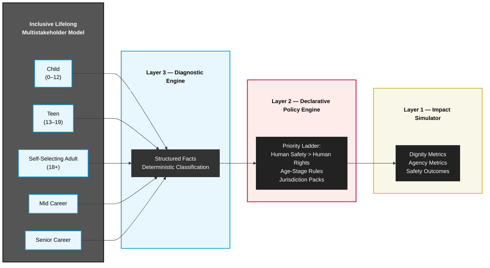

```mermaid
flowchart LR

    %% ==== ILMM COLUMN ====
    subgraph ILMM[" "]
        direction TB
        ILMM_TITLE["Inclusive Lifelong<br/>Multistakeholder Model"]

        AG1["Child<br/>(0–12)"]
        AG2["Teen<br/>(13–19)"]
        AG3["Self-Selecting Adult<br/>(18+)"]
        AG4["Mid Career"]
        AG5["Senior Career"]
    end

    style ILMM fill:#555555,stroke:#0A0A0A,stroke-width:2px,color:#000000
    style ILMM_TITLE fill:#555555,stroke:none,color:#FFFFFF,font-weight:600
    style AG1 fill:#E8F6FD,stroke:#009EDB,stroke-width:2px,color:#000000
    style AG2 fill:#E8F6FD,stroke:#009EDB,stroke-width:2px,color:#000000
    style AG3 fill:#E8F6FD,stroke:#009EDB,stroke-width:2px,color:#000000
    style AG4 fill:#E8F6FD,stroke:#009EDB,stroke-width:2px,color:#000000
    style AG5 fill:#E8F6FD,stroke:#009EDB,stroke-width:2px,color:#000000

    %% ==== LAYER 3 BOX ====
    subgraph L3[" "]
        direction TB
        L3_TITLE["Layer 3 — Diagnostic Engine"]
        L3OUT["Structured Facts<br/>Deterministic Classification"]
    end

    style L3 fill:#E8F6FD,stroke:#009EDB,stroke-width:2px,color:#000000
    style L3_TITLE fill:#E8F6FD,stroke:none,color:#000000,font-weight:600
    style L3OUT fill:#333333,stroke:#222222,color:#FFFFFF

    %% ==== LAYER 2 BOX ====
    subgraph L2[" "]
        direction TB
        L2_TITLE["Layer 2 — Declarative Policy Engine"]
        RULES["Priority Ladder:<br/>Human Safety > Human Rights<br/>Age-Stage Rules<br/>Jurisdiction Packs"]
    end

    style L2 fill:#FDECEA,stroke:#C40233,stroke-width:2px,color:#000000
    style L2_TITLE fill:#FDECEA,stroke:none,color:#000000,font-weight:600
    style RULES fill:#222222,stroke:#111111,color:#FFFFFF

    %% ==== LAYER 1 BOX ====
    subgraph L1[" "]
        direction TB
        L1_TITLE["Layer 1 — Impact Simulator"]
        IMP["Dignity Metrics<br/>Agency Metrics<br/>Safety Outcomes"]
    end

    style L1 fill:#F9F7E8,stroke:#D4AF37,stroke-width:2px,color:#000000
    style L1_TITLE fill:#F9F7E8,stroke:none,color:#000000,font-weight:600
    style IMP fill:#222222,stroke:#111111,color:#FFFFFF

    %% ==== CONNECTIONS ====
    AG1 --> L3OUT
    AG2 --> L3OUT
    AG3 --> L3OUT
    AG4 --> L3OUT
    AG5 --> L3OUT

    L3OUT --> RULES --> IMP
```
